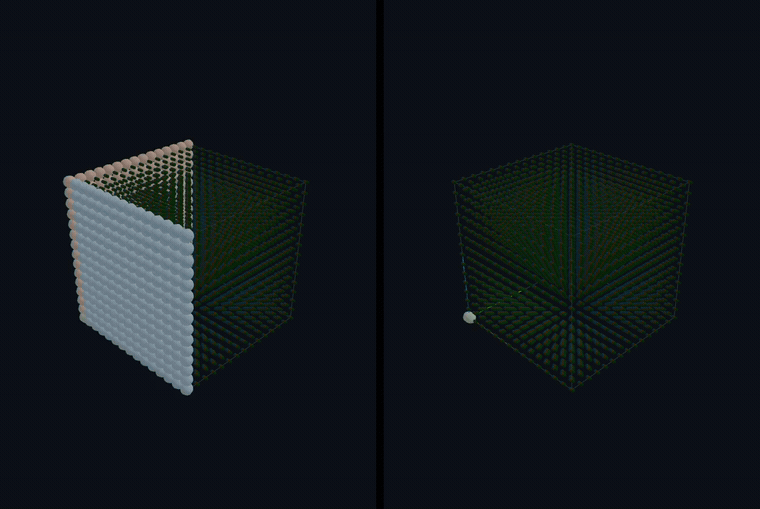
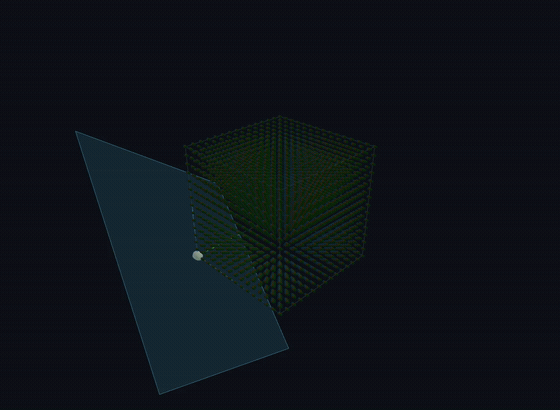

# dfa-dynamics

Domain Flow Architecture dynamics

# Introduction

The vision of the Domain Flow Architecture repo is to build tools that can read and analyze MLIR bytecode.
The analysis is tailored to finding efficient schedules and spatial reductions to execute DL graphs efficiently
on a variety of hardware configurations.


The basic architecture represents DL graphs as pure domain flow graphs.
A domain flow graph is represented by chains of operators, each with a domain of computation. 
The operator is defined by a System of Affine Recurrence Equations. 
The domain of computation is derived from the tensor operands and the operator.
The most common representation of DNN models in the different DNN frameworks 
uses function nodes with tensor operands. This contains all the information
to derive the domain of computation for the Domain Flow graph.

The MLIR linalg and affine dialects represent loop nests and memory views.
In contrast the dfa dialect represents operators and domain flows.
Operators are hypothesized to execute in multi-dimensional data paths,
and the goal of the analysis is to find spatial reductions that avoid
resource contention.


## Visualizing schedules



The same matrix-multiply recurrence under two schedules, driven by one clock: the data-flow-earliest
(**free**) schedule on the left finishes in 29 steps and holds, while the **linear** schedule on the
right keeps sweeping to 43 — the extra steps are the latency it trades for a smaller, regular,
systolic footprint.



Zooming in on that linear schedule: the translucent **signature plane** (normal to the scheduling
vector τ) sweeps the index space — each lattice point fires as the wavefront reaches it, so the
plane's motion *is* the schedule and its cross-section is the parallelism.

The documentation site renders the catalog as **interactive 3-D animations**
(wavefront sweeps, the τ-normal signature plane, dependency arrows, legality coloring) plus
node-link **Reduced Dependency Graphs** for every SURE/SARE operator. Explore them live at
[branes-ai.github.io/domain_flow](https://branes-ai.github.io/domain_flow/theory/matmul/); the clips
are rendered offline from those same viewers with `npm run video` (see `docs-site/make-video.mjs`).


## Prerequisites

- **CMake** 3.28+
- **C++20 compiler** (GCC 10+, Clang 12+, MSVC 2022+)
- **Ninja** build system (optional but recommended)
- **vcpkg** (Windows only)
- **LLVM/MLIR** 17+ (optional, for MLIR tools)

### Platform-Specific Setup

The project uses platform-specific CMake preset templates:

**Linux:**
```bash
cp CMakeUserPresets.json.Linux.template CMakeUserPresets.json
# Edit CMakeUserPresets.json to set your LLVM_PROJECT_ROOT if using MLIR
```

**Windows:**
```bash
cp CMakeUserPresets.json.Windows.template CMakeUserPresets.json
# Edit CMakeUserPresets.json to set VCPKG_ROOT and LLVM_PROJECT_ROOT
```

See [SETUP.md](SETUP.md) for detailed platform-specific setup instructions.

## Quick Start

### Basic Build (No MLIR)

```bash
# Clean the build directory
rm -rf build/user-ninja-release

# Configure
cmake --preset user-ninja-release

# Build all targets
cmake --build build/user-ninja-release

# Run tests
ctest --test-dir build/user-ninja-release

# Run a sample workload
./build/user-ninja-release/workloads/dfa/dfa_domain_flow

# Run the SURE simulator CLI (see docs/sure-simulator.md)
./build/user-ninja-release/sim/dfactl matmul --tau 1,1,1
```

### Build with MLIR Tools

#### Step 1: Build LLVM/MLIR 20.x

Use the provided script (takes 30-60 minutes):

```bash
./scripts/build-llvm-mlir.sh
```

Or build manually:

```bash
# Clone LLVM
git clone https://github.com/llvm/llvm-project.git --branch release/20.x --depth 1

# Build
mkdir -p ~/dev/builds/llvm-20x
cd ~/dev/builds/llvm-20x
cmake ~/dev/clones/llvm-project/llvm \
    -GNinja \
    -DLLVM_ENABLE_PROJECTS="mlir;clang" \
    -DLLVM_TARGETS_TO_BUILD="host" \
    -DCMAKE_BUILD_TYPE=Release \
    -DLLVM_ENABLE_ASSERTIONS=ON \
    -DCMAKE_INSTALL_PREFIX=~/dev/installs/llvm-20x
cmake --build . --target install -j$(nproc)
```

#### Step 2: Configure Domain Flow with MLIR

Add to your `CMakeUserPresets.json`:

```json
{
  "configurePresets": [
    {
      "name": "user-ninja-release-mlir",
      "inherits": "Ninja-Release",
      "environment": {
        "LLVM_PROJECT_ROOT": "/path/to/llvm-project"
      },
      "cacheVariables": {
        "DOMAINFLOW_MLIR_TOOLS": "ON",
        "LLVM_DIR": {
          "type": "PATH",
          "value": "/path/to/llvm-install/lib/cmake/llvm"
        },
        "MLIR_DIR": {
          "type": "PATH",
          "value": "/path/to/llvm-install/lib/cmake/mlir"
        }
      }
    }
  ]
}
```

#### Step 3: Build

```bash
# Configure with MLIR
cmake --preset user-ninja-release-mlir

# Build MLIR tools
cmake --build build/user-ninja-release-mlir

# Build specific MLIR target (e.g., TOSA importer)
cmake --build build/user-ninja-release-mlir --target dfa-import-tosa
```

## Build Options

Control features with CMake options:

```bash
cmake --preset user-ninja-release \
  -DDOMAINFLOW_BUILD_TESTING=ON \
  -DDOMAINFLOW_TOOLS=ON \
  -DDOMAINFLOW_DSE=ON \
  -DDOMAINFLOW_MLIR_TOOLS=ON
```

Available options:
- `DOMAINFLOW_BUILD_TESTING` - Build and register tests (default: `BUILD_TESTING` when built as root project, OFF as subproject)
- `DOMAINFLOW_TOOLS` - Build dfg/rdg tools (default: OFF)
- `DOMAINFLOW_POLYHEDRAL` - Build polyhedral tools (default: ON)
- `DOMAINFLOW_MLIR_TOOLS` - Build MLIR integration (default: OFF, requires LLVM/MLIR)
- `DOMAINFLOW_DSE` - Build design space exploration tools (default: OFF)
- `DOMAINFLOW_VISUALIZATION` - Build visualization tools (default: OFF)

Structure of the build:

|          Option           |       Adds subdir       |           Requires           |
|---------------------------|-------------------------|------------------------------|
| DOMAINFLOW_MATPLOT_TOOLS  | plots/                  | Matplot++ ← your first error │
| DOMAINFLOW_VISUALIZATION  | tools/viz/              | CGAL (+ Qt6) ← this error    |
| DOMAINFLOW_MLIR_TOOLS     | tools/opt, tools/import | MLIR/LLVM                    |
| DOMAINFLOW_DATABASE_TOOLS | (database)              | DB libs                      |
| DOMAINFLOW_TOOLS          | tools/rdg, tools/dfg    | —                            |
| DOMAINFLOW_DSE            | tools/dse               | —                            |
| DOMAINFLOW_POLYHEDRAL     | src/polyhedral          | —                            |

The key point: kpu-sim consumes domain_flow only as an IR/polyhedral library (kpu_dataflow / kpu_compiler link it for math). It uses none of these
tools/viz/plots. So for the kpu-sim build, DOMAINFLOW_VISUALIZATION, DOMAINFLOW_MATPLOT_TOOLS, and the rest should all be OFF — none of Matplot++, CGAL,
Qt6, or MLIR is needed.

## Useful Commands

```bash
# Quick clean and rebuild
rm -rf build/user-ninja-release && cmake --preset user-ninja-release && cmake --build build/user-ninja-release

# Build with verbose output
cmake --build build/user-ninja-release --verbose

# Build specific target
cmake --build build/user-ninja-release --target dfa_domain_flow

# Clean all build variants
rm -rf build/
```

## Documentation

- **[Documentation site](https://branes-ai.github.io/domain_flow/)** - Published docs (getting started, architecture, SURE simulator, theory)
- [SETUP.md](SETUP.md) - Detailed platform-specific setup guide
- [ARCHITECTURE.md](ARCHITECTURE.md) - Architecture overview and development guide
- [docs/sure-simulator.md](docs/sure-simulator.md) - The SURE simulator: why, what, and how, with worked examples
- [docs/](docs/) - Additional documentation
